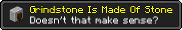
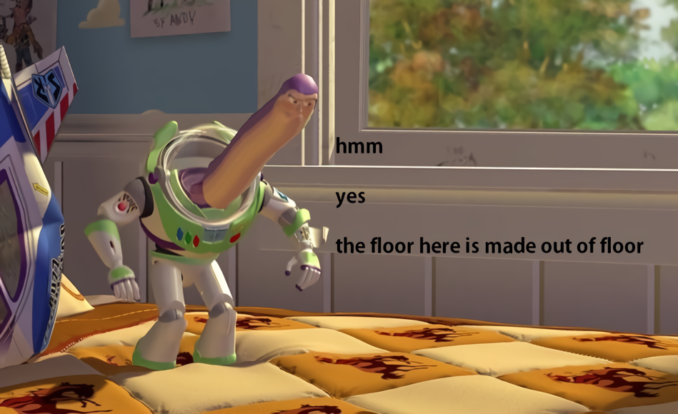

# Grindstone Is Made Of Stone (Fabric)
[](https://github.com/Kir-Antipov/grindstone-is-made-of-stone/releases/latest)
[](https://github.com/Kir-Antipov/grindstone-is-made-of-stone/actions/workflows/build-artifacts.yml)
[![Modrinth](https://img.shields.io/badge/dynamic/json?color=5da545&label=Modrinth&query=title&url=https://api.modrinth.com/api/v1/mod/grindstone-is-made-of-stone&style=flat&cacheSeconds=3600&logo=data:image/svg+xml;base64,PHN2ZyB4bWxucz0iaHR0cDovL3d3dy53My5vcmcvMjAwMC9zdmciIHZpZXdCb3g9IjAgMCAxMSAxMSIgd2lkdGg9IjE0LjY2NyIgaGVpZ2h0PSIxNC42NjciICB4bWxuczp2PSJodHRwczovL3ZlY3RhLmlvL25hbm8iPjxkZWZzPjxjbGlwUGF0aCBpZD0iQSI+PHBhdGggZD0iTTAgMGgxMXYxMUgweiIvPjwvY2xpcFBhdGg+PC9kZWZzPjxnIGNsaXAtcGF0aD0idXJsKCNBKSI+PHBhdGggZD0iTTEuMzA5IDcuODU3YTQuNjQgNC42NCAwIDAgMS0uNDYxLTEuMDYzSDBDLjU5MSA5LjIwNiAyLjc5NiAxMSA1LjQyMiAxMWMxLjk4MSAwIDMuNzIyLTEuMDIgNC43MTEtMi41NTZoMGwtLjc1LS4zNDVjLS44NTQgMS4yNjEtMi4zMSAyLjA5Mi0zLjk2MSAyLjA5MmE0Ljc4IDQuNzggMCAwIDEtMy4wMDUtMS4wNTVsMS44MDktMS40NzQuOTg0Ljg0NyAxLjkwNS0xLjAwM0w4LjE3NCA1LjgybC0uMzg0LS43ODYtMS4xMTYuNjM1LS41MTYuNjk0LS42MjYuMjM2LS44NzMtLjM4N2gwbC0uMjEzLS45MS4zNTUtLjU2Ljc4Ny0uMzcuODQ1LS45NTktLjcwMi0uNTEtMS44NzQuNzEzLTEuMzYyIDEuNjUxLjY0NSAxLjA5OC0xLjgzMSAxLjQ5MnptOS42MTQtMS40NEE1LjQ0IDUuNDQgMCAwIDAgMTEgNS41QzExIDIuNDY0IDguNTAxIDAgNS40MjIgMCAyLjc5NiAwIC41OTEgMS43OTQgMCA0LjIwNmguODQ4QzEuNDE5IDIuMjQ1IDMuMjUyLjgwOSA1LjQyMi44MDljMi42MjYgMCA0Ljc1OCAyLjEwMiA0Ljc1OCA0LjY5MSAwIC4xOS0uMDEyLjM3Ni0uMDM0LjU2bC43NzcuMzU3aDB6IiBmaWxsLXJ1bGU9ImV2ZW5vZGQiIGZpbGw9IiM1ZGE0MjYiLz48L2c+PC9zdmc+)](https://modrinth.com/mod/grindstone-is-made-of-stone)
[](https://www.curseforge.com/minecraft/mc-mods/grindstone-is-made-of-stone)
[](https://github.com/Kir-Antipov/grindstone-is-made-of-stone#readme)

Well, grindstone looks like stone, sounds like stone and literally has `stone` in its name; so I think it should be made of stone.



For some reason, Mojang [felt it differently](https://bugs.mojang.com/browse/MC-140498) and set grindstone's material to heavy metal; so it can't be moved by a piston (unlike other workstations).

This little mod corrects this misconception.

----

## Installation

Requirements:
- Minecraft `1.15.x`
- Fabric Loader `>=0.7.0`

You can download the mod from:

- [GitHub Releases](https://github.com/Kir-Antipov/grindstone-is-made-of-stone/releases/latest) <sup><sub>(recommended)</sub></sup>
- [Modrinth](https://modrinth.com/mod/grindstone-is-made-of-stone)
- [CurseForge](https://www.curseforge.com/minecraft/mc-mods/grindstone-is-made-of-stone)
- [GitHub Actions](https://github.com/Kir-Antipov/grindstone-is-made-of-stone/actions/workflows/build-artifacts.yml) *(these builds may be unstable, but they represent the actual state of the development)*

## Building from sources

Requirements:
- JDK `16`

### Linux/MacOS

```cmd
git clone https://github.com/Kir-Antipov/grindstone-is-made-of-stone.git
cd grindstone-is-made-of-stone

chmod +x ./gradlew
./gradlew build
cd build/libs
```
### Windows

```cmd
git clone https://github.com/Kir-Antipov/grindstone-is-made-of-stone.git
cd grindstone-is-made-of-stone

gradlew build
cd build/libs
```